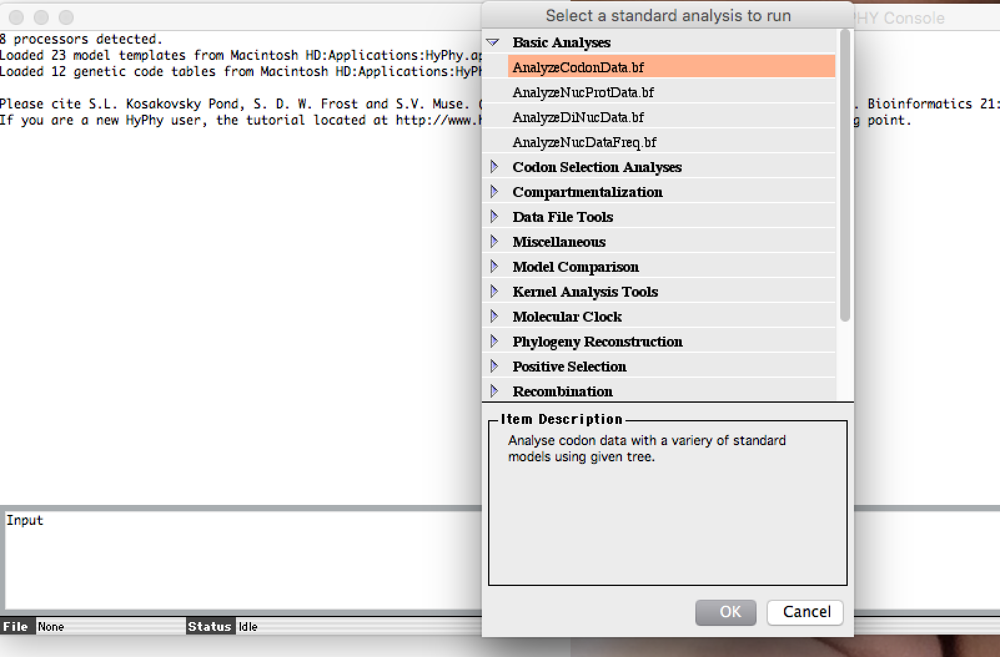
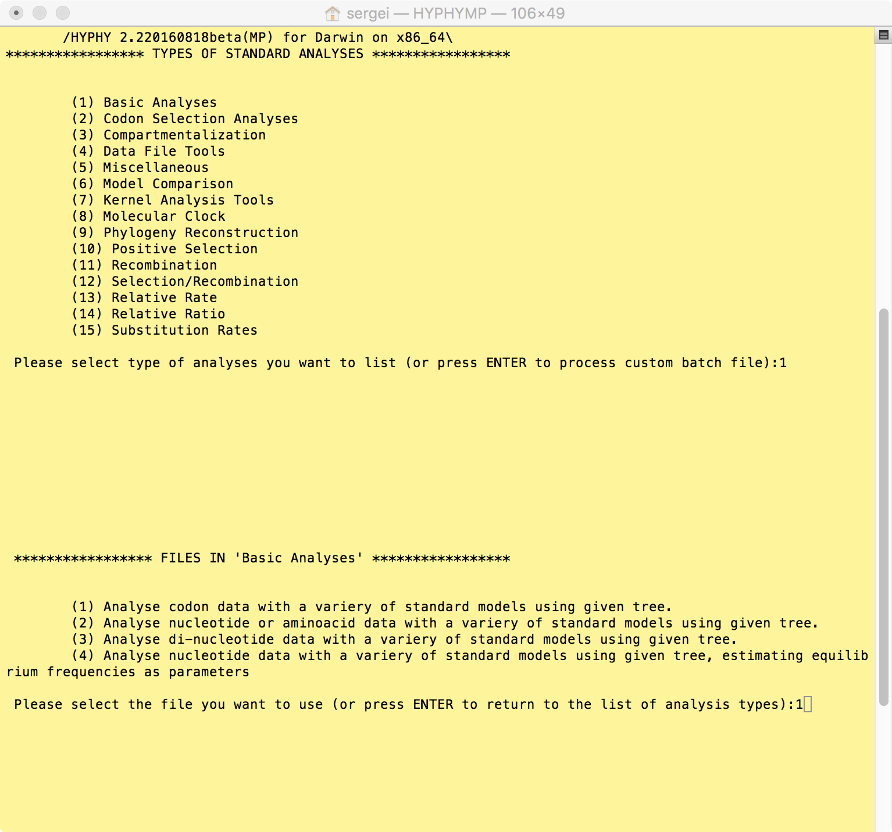
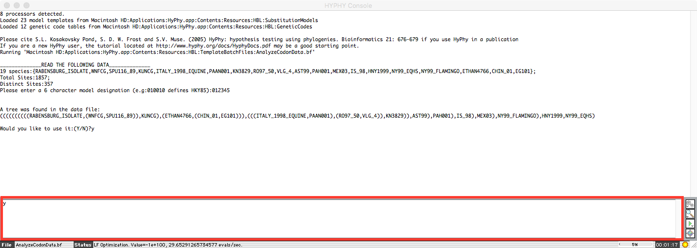
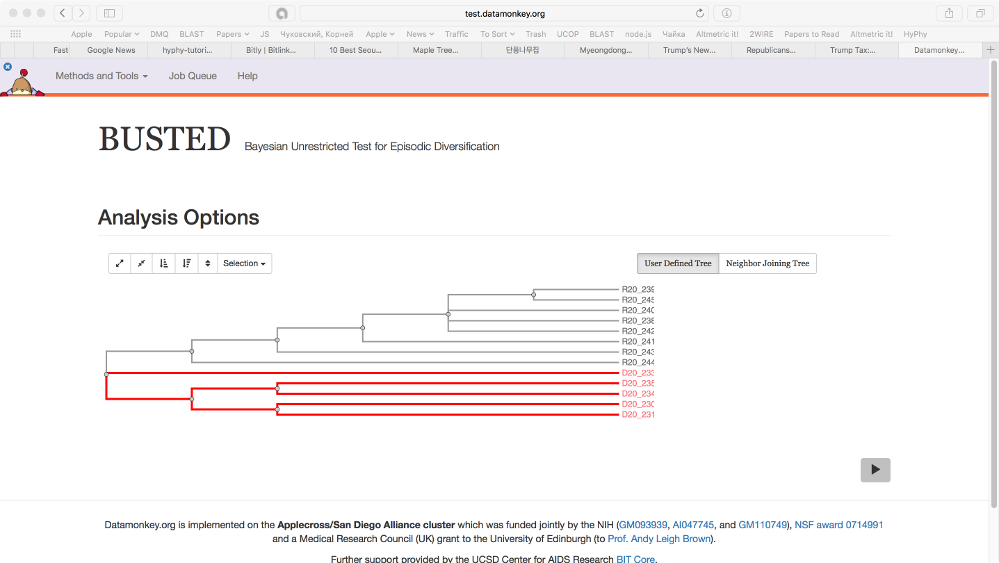
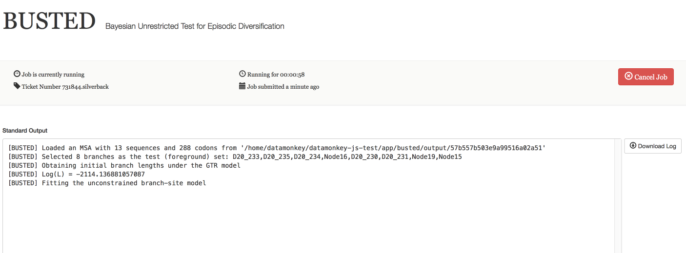

Selection detection.
====================

__Data files__

All the example alignment files used here are available in this [data directory](data).
You may find it convenient to download the [zip file](https://github.com/veg/hyphy-tutorials/blob/master/selection/data/files.zip?raw=true)
with all the files from that directory, and unpack it on your machine.

__Notation__

We will use the following notation.

1. `filename` refers to a file on your local file system.
2. **Option** refers to an analysis option that you will select when prompted by HyPhy.
3. *Menu item* refers to a menu option you will select in the Mac OS X or Windows GUI (Graphical User Interface) version of HyPhy,
or a command line you will supply in terminal with the command line version of HyPhy.
4. <tt>X</tt> refers to a model parameter X.
5. The following formatting denotes text output to the screen by HyPhy.

```
[BUSTED] Selected 35 branches as the test (foreground) set: RABENSBURG_ISOLATE,WNFCG,SPU116_89,Node11,Node9,KUNCG,Node8,..
[BUSTED] Obtaining initial branch lengths under the GTR model
[BUSTED] Log(L) = -7745.475588071066
[BUSTED] Fitting the unconstrained branch-site model
```

Estimate alignment-wide &omega;.
--------------------------------

1. Select the appropriate analysis to run
  * **[if using GUI]** Choose *Analysis:Standard Analyses:Basic Analyses:AnalyzeCodonData.bf*
  
  
  * **[if using CLI]** When presented with the list of standard analysis options upon launch, choose *Basic Analyses*, then option 1 (*Analyse codon data with a variery of standard models using given tree.*)
  
  
  
2. **Universal** genetic code option
3. The file to process
  * **[GUI]** In the file dialog, navigate to and select `WestNileVirus_NS3.fas`
  * **[CLI]** Input the full path name to the file (make sure there is no trailing space), e.g.
  `/Users/sergei/Coding/hyphy-tutorials/selection/data/WestNileVirus_NS3.fas`
4. **MG94CUSTOMCF3X4** model; the [Muse Gaut 94](http://www.ncbi.nlm.nih.gov/pubmed/7968485) model with the [CF3x4](http://journals.plos.org/plosone/article?id=10.1371/journal.pone.0011230) frequency estimator.
5. **Global** model parameter option; estimate rate parameters jointly from all sites and branches.
6. **012345** nucleotide substitution rates; estimate the general time reversible (GTR, 5 rates) model.
7. Confirm that the tree included in the file will be used
  * **[GUI]** Type **y** into the **bottom box of the console window** (see red box in the image) and hit "Enter"
  
  
  * **[CLI]** Type **y** and hit "Enter"
8. **Estimate** branch lengths directly

The output should look like this

```
______________RESULTS______________
Log Likelihood = -6413.50468184347;
Shared Parameters:
R=0.008557848966878849
GT=0.2303600815210618
CT=1.979989664067556
CG=0.02076764883647483
AC=0.2428440082030551
AT=0.3056061615274677

Tree givenTree=((((((HNY1999:0.001101787189557129,NY99_EQHS:0.00108698796444847)Node6:0,NY99_FLAMINGO:0)Node5:0,MEX03:0.003274397587748566)Node4:0.001043699094072735,IS_98:0.002238969679775947)Node3:0.0108106327401535,PAH001:0.009947231998139823)Node2:0.006480815229843424,AST99:0.01679372620666718,((((RABENSBURG_ISOLATE:1.05102590132809,(WNFCG:0.01053193289945618,SPU116_89:0.00569613982107767)Node19:0.507068944265484)Node17:0.5772661357618611,KUNCG:0.08756311980263866)Node16:0.06947527827356371,(ETHAN4766:0.02385184540957046,(CHIN_01:0.01206163326344818,EG101:0.01506055273715259)Node25:0.007681688497219724)Node23:0.003442808476468687)Node15:0.01851421610241251,(((ITALY_1998_EQUINE:0.009037431851104481,PAAN001:0.007872553578665653)Node30:0.002694356278175029,(RO97_50:0.001642931262019352,VLG_4:0.00108305411902561)Node33:0.002794580801147744)Node29:0.0007243769694723316,KN3829:0.003058011972423634)Node28:0.01097965849521703)Node14:0.00929314901848397);
```

The <tt>R</tt> parameter denotes the global &omega; (dN/dS) ratio and is the object of this analysis.

Run alignment-wide tests for episodic diversification (BUSTED).
------------------------------------------------------------------

>BUSTED is a method described in [Murrell et al](http://www.ncbi.nlm.nih.gov/pubmed/25701167). It has been extensively tested and shows better power and accuracy than either ["branch-site" models in PAML](http://mbe.oxfordjournals.org/content/24/5/1219.short), or the ["covarion" style models](http://mbe.oxfordjournals.org/content/early/2013/10/16/molbev.mst198)

We will perform branch-site model-based tests for episodic selection affecting a proportion of sites in
the alignment along a proportion of branches in the tree (i.e. is there evidence of selection **anywhere** in the alignment and **anywhere** on the tree).
The data set in we are using includes partial clonal HIV-1 env sequences from epidemiologically linked partners (source and recipient)

1. Select the appropriate analysis to run
  * **[GUI]** Choose *Analysis:Standard Analyses:Positive Selection:BUSTED.bf*
  * **[CLI]** When presented with the list of standard analysis options upon launch, choose *Positive Selection*, then option 4 (*Run the Branch-site Unrestricted Statistical Test for Episodic Diversification to test for evidence of episodic alignment-wide selective pressure.*)
2. **Universal** genetic code option
3. The file to process
  * **[GUI]** In the file dialog, navigate to and select `HIV.nex`
  * **[CLI]** Input the full path name to the file (make sure there is no trailing space), e.g. `/Users/sergei/Coding/hyphy-tutorials/selection/data/HIV.nex`
4. Confirm that the tree included in the file will be used
  * **[GUI]** Type **y** into the bottom box of the console window and hit Enter
  * **[CLI]** Type **y** and hit Enter
5. Choose all branches to include in the test (**All**)
  * **[CLI]** You will need to type **d** and hit "Enter" after selecting the **All** option to exit the selection dialog.

The analysis will now run for a few minutes and produce the following output

```
[BUSTED] Selected 26 branches as the test (foreground) set: R20_239,R20_245,Node5,R20_240,R20_238,R20_242,Node4,R20_241,Node3,R20_243,Node2,R20_244,Node1,D20_233,D20_235,D20_236,D20_232,Node17,D20_234,D20_237,Node21,Node16,D20_230,D20_231,Node24,Node15 
[BUSTED] Obtaining initial branch lengths under the GTR model 
[BUSTED] Log(L) = -2114.132335772669 
[BUSTED] Fitting the unconstrained branch-site model 
[BUSTED] Log(L) = -2039.992959126133. Unrestricted class omega = 104.6591567580357 (weight = 0.02032866068122922) 
[BUSTED] Fitting the branch-site model that disallows omega > 1 among foreground branches 
[BUSTED] Log(L) = -2076.666683221396 
[BUSTED] Likelihood ratio test for episodic positive selection, p = 1.110223024625157e-16 
```

For example, in this case the analysis inferred that

1. A proportion of sites (~0.02) is evolving with dN/dS &gt; 1 (~105) along a subset of the branches (it is not known which).
2. Forcing dN/dS = 1 provides a significantly worse (p ~ 10<sup>-16</sup>) fit to the data, i.e. rejects the hypothesis of no positive selection in the alignment.

In addition to this output, HyPhy will also generate a [JSON](http://json.org) file with a more detailed analysis output. The JSON will be written to same directory as the input alignment file, with `BUSTED.json` appended to the file name, e.g. `/Users/sergei/Coding/hyphy-tutorials/selection/data/HIV.nex.BUSTED.json`  This JSON file can be visualized and explored with this [web app](http://veg.github.io/hyphy-vision/busted/), e.g., to obtain plots like those shown in the lecture slides.

### Run BUSTED using datamonkey.org

1. Navigate to http://test.datamonkey.org, selected _BUSTED_ from the _Methods and Tools_ menu.
2. Choose the file to analyze on the next screen.
3. Use the analysis setup screen to select all the `donor` branches as the foreground (shift-click on the branches to add them to selection)

4. As the analysis runs, you will see a progress page looking something  like this

5. When the analysis finishes, you will be directed to a results page, which is very similar to the web app referenced above

### Testing for selection on an *a priori* specified set of branches

The tree in the `HIV.nex` is annotated with {} to indicate the set of test ("foreground") branches (e.g. you can use this [widget](http://veg.github.io/phylotree.js/) to select foreground
branches and then export them to Newick using the *Newick:Export* menu dialog).

in this case the branch being tested is the *transmission* branch, i.e. the one separating the source and the recipient in the phylogenetic tree.
BUSTED will only constrain &omega; < 1 on these branches (allowing the rest of the tree to have its own &omega; distribution) during testing.

An annotated Newick string looks like this (a single branch):

>((((((R20_239:0.001179071552709126,R20_245:0.003569393318767422):0.002373643652152119,R20_240:0.00354445225954759,
>R20_238:0,R20_242:0.007143686359514547):0.001169032517101171,R20_241:0.003555888002841892):0.001829250056707198,
>R20_243:0.006486065374683752):0.003845820830922537,R20_244:0.02113434306810657)**{Test}**:0.03269082780807394,
>D20_233:0.02550919363771013,(((D20_235:0,D20_236:0,D20_232:0):0.006433904687642939,
>(D20_234:0,D20_237:0):0.005843978498632621):0.01022675723558638,
>(D20_230:0.02979851732996924,D20_231:0.006905678660095517):0.02444611465196596):0.005946252173834307);

Repeat the analysis from the previous section, choosing option 4 (**Set Test**) in step 5.
Note that you could also manually select the set of branches to test in the same dialog.

The results of this *a priori* analysis are

```
[BUSTED] Selected 1 branches as the test (foreground) set: Node1 
[BUSTED] Obtaining initial branch lengths under the GTR model 
[BUSTED] Log(L) = -2114.13233621422 
[BUSTED] Fitting the unconstrained branch-site model 
[BUSTED] Log(L) = -2031.302017161514. Unrestricted class omega = 524.9720891747666 (weight = 0.07815647810018292) 
[BUSTED] Fitting the branch-site model that disallows omega > 1 among foreground branches 
[BUSTED] Log(L) = -2050.101940483789 
[BUSTED] Likelihood ratio test for episodic positive selection, p = 6.843795752331516e-09 
```

#### Questions.

0. Use the [web app](http://veg.github.io/hyphy-vision/busted/) to visualize the JSON result file from this analysis and
compare the inferred &omega; distributions for the foreground and background branches.
1. Explain why the log-likelihood for the unconstrained model is higher for the case when *a priori* branches are tested?
2. Do these results suggest that the transmission branch is evolving differently from the rest of the tree?
3. If the *a priori* analysis had a negative result (no selection along the transmission branch), might it still be possible to
find evidence of selection in the **All** branches analysis?

Use aBSREL to find lineages which have experienced episodic diversification.
----------------------------------

>aBSREL is a method described in [Smith et al](http://www.ncbi.nlm.nih.gov/pubmed/25697341). It is an extension of our popular [BS-REL model](http://www.ncbi.nlm.nih.gov/pubmed/21670087), which performs a complexity analysis and model selection prior to doing hypothesis testing. It runs much faster than BS-REL and has better statistical properies.

We continue using the `HIV.nex` dataset from the previous example, but now we are interested in scanning the phylogeny
for all the branches where selection may have operated.

1. Select the appropriate analysis to run
  * **[GUI]** Choose *Analysis:Standard Analyses:Positive Selection:BranchSiteREL.bf*
  * **[CLI]** When presented with the list of standard analysis options upon launch, choose *Positive Selection*, then option 1 (*Use the random effects branch-site model (2010) to find lineages subject to episodic selection.*)
2. **Universal** genetic code option
3. **Yes** to choose the adaptive version of BSREL.
4. **No** to assume that synonymous rates do not vary from site to site
5. The file to process
  * **[GUI]** In the file dialog, navigate to and select `HIV.nex'`
  * **[CLI]** Input the full path name to the file (make sure there is no trailing space), e.g. `/Users/sergei/Coding/hyphy-tutorials/selection/data/HIV.nex`
6. Decline to use the tree included in the file (annotation from the previous step conflicts with the current aBSREL implementaton)
  * **[GUI]** Type **n** into the bottom box of the console window and hit Enter
  * **[CLI]** Type **n** and hit Enter
7. Choose the tree file
  * **[GUI]** In the file dialog, navigate to and select `HIV.nwk'`
  * **[CLI]** Input the full path name to the file (make sure there is no trailing space), e.g. `/Users/sergei/Coding/hyphy-tutorials/selection/data/HIV.nwk`
8. Choose all branches to test (**All**)
  * **[CLI]** You will need to type **d** and hit Enter after selecting the **All** option to exit the selection dialog.
9. Where to save the analysis results (more than one file, see below)
  * **[GUI]** In the file dialog, find a place to save the result file, naming it `HIV.aBSREL`.
  * **[CLI]** Input the full path name to the file (make sure there is no trailing space), e.g. `/Users/sergei/Coding/hyphy-tutorials/selection/data/HIV.aBSREL`

The analysis will now run for several minutes and produce a lot of diagnostic output.

As the initial phase, aBSREL fits the standard Muse-Gaut 94 model which estimates a single &omega; for each branch and prints out model fit statistics. This is the simplest model that can be selected by aBSREL.

```
[PHASE 0] Fitting the local MG94 (no site-to-site variation) to obtain initial parameter estimates

Log L = -2069.673153141118 with 66 degrees of freedom. IC = 4273.293894919101

Branch omega values

	Count    = 26
	Mean     = 5.015163008040247
	Median   = 1.911847453671735
	Variance = 20.26898469566522
	Std.Dev  = 4.502108916459621
	COV      = 0.8976994185915583
	Sum      = 130.3942382090464
	Sq. sum  = 1160.672977319228
	Skewness = 0.8547462897381892
	Kurtosis = 58.55544061358484
	Min      = 0.1474879956566399
	2.5%     = 0.1474879956566399
	97.5%    = 10
	Max      = 10
```

Next, aBSREL sorts all the branches by length (longest first), and tries to greedily add &omega; categories to one branch at a time, until the addition is no longer justified by AIC<sub>c</sub> scores. For example, for *Node1* (the transmission branch)

```
[PHASE 1] Fitting Branch Site REL models to one branch at a time

[PHASE 1] Branch Node1 log(L) = -2048.380, IC = 4234.826
	2 rate classes
	Node: mixtureTree.Node1
	Length parameter = 0.01335020389229876
	Class 1
		omega = 0.736
		weight = 0.927
	Class 2
		omega = 499.798
		weight = 0.073

[PHASE 1] Branch Node1 log(L) = -2048.447423263603, IC = 4239.085721554758
	3 rate classes
	Node: mixtureTree.Node1
	Length parameter = 0.0194263003300435
	Class 1
		omega = 0.385
		weight = 0.925
	Class 2
		omega = 0.000
		weight = 0.000
	Class 3
		omega = 314.702
		weight = 0.075
```

using two rate classes improves the IC from 4273.3 to 4234.83, but going to three rate classes is not justified. aBSREL will now fix a 2-bin &omega; distribution for <tt>Node1</tt> and move to the next branch. When all branches are done, a summary of inferred model complexity will be printed to the screen.

```
[INFERRED MODEL COMPLEXITY]
	mixtureTree.R20_239 has 1 site rate classes
	mixtureTree.R20_245 has 1 site rate classes
	mixtureTree.Node5 has 1 site rate classes
	mixtureTree.R20_240 has 1 site rate classes
	mixtureTree.R20_238 has 1 site rate classes
	mixtureTree.R20_242 has 1 site rate classes
	mixtureTree.Node4 has 1 site rate classes
	mixtureTree.R20_241 has 1 site rate classes
	mixtureTree.Node3 has 1 site rate classes
	mixtureTree.R20_243 has 1 site rate classes
	mixtureTree.Node2 has 1 site rate classes
	mixtureTree.R20_244 has 1 site rate classes
	mixtureTree.Node1 has 2 site rate classes
	mixtureTree.D20_233 has 2 site rate classes
	mixtureTree.D20_235 has 1 site rate classes
	mixtureTree.D20_236 has 1 site rate classes
	mixtureTree.D20_232 has 1 site rate classes
	mixtureTree.Node17 has 1 site rate classes
	mixtureTree.D20_234 has 1 site rate classes
	mixtureTree.D20_237 has 1 site rate classes
	mixtureTree.Node21 has 1 site rate classes
	mixtureTree.Node16 has 2 site rate classes
	mixtureTree.D20_230 has 2 site rate classes
	mixtureTree.D20_231 has 1 site rate classes
	mixtureTree.Node24 has 2 site rate classes
	mixtureTree.Node15 has 1 site rate classes
```

Note that only a few branches support 2 &omega; classes, and the majority are well-explained without any site-to-site variation.
In the next phase, aBSREL optimizes all parameters in the just inferred model model

```
[PHASE 2] Fitting the full LOCAL alternative model (no constraints)

Log L = -2010.471450731734 with 76 degrees of freedom, IC = 4175.52599570315
((((((R20_239:0.001180872214151883,R20_245:0.003568958594949872)Node5:0.00238190144130175,R20_240:0.003553829750818045,R20_238:0,R20_242:0.00716830032133561)Node4:0.001173481128053423,R20_241:0.003576676330678178)Node3:0.00155544697576297,R20_243:0.006756755941630225)Node2:0.00415900454948532,R20_244:0.02082000515352331)Node1:0.2905921716926325,D20_233:1.951982256546112,(((D20_235:0,D20_236:0,D20_232:0)Node17:0.006441027083836533,(D20_234:0,D20_237:0)Node21:0.005840812770752585)Node16:0.2538902924947701,(D20_230:1.765119288716005,D20_231:0.007781540968601186)Node24:0.02458866035691175)Node15:0)

```

Next, the analysis will proceed to test all the branches we selected in step 8 (which is *All*) to see if there is a proportion of sites
with &omega; > 1 along that branch, and whose removal would cause a significant drop in log-likelihood. As a shortcut, if the branch has no sites with &omega; > 1, it will not be tested (one can just set the p-value to 0.5).

This is the most time consuming phase of the analysis. As the tests are done, aBSREL will print out a running tally to the screen, including the rate distribution inferred for a particular branch under the null (&omega; &le; 1) model, and the p-value for the branch. For example, the snippet below shows the alternative and null distributions of &omega; along Node1 (the same branch we tested with BUSTED previously), and reports the *uncorrected* p-value for the test of selection at this branch.

```
Node: mixtureTree.Node1
	Length parameter = 0.02933683537846648
	Class 1
		omega = 0.872
		weight = 0.932
	Class 2
		omega = 751.770
		weight = 0.068
...Testing for selection at this branch

Node: mixtureTree.Node1
	Length parameter = 0.08668188509082339
	Class 1
		omega = 0.816
		weight = 0.000
	Class 2
		omega = 1.000
		weight = 1.000
p-value = 9.103440223867665e-12

```

Once all the tests have been done, aBSREL will print out the list of all branches with p-values below 0.05 **after**
applying the [Holm-Bonferroni multiple testing correction](http://en.wikipedia.org/wiki/Holm–Bonferroni_method), and a CPU time report.

```
Summary of branches under episodic selection (26 were tested, of which 14 required optimizations) :
	Node1 p = 2.45792886044427e-10
	D20_233 p = 0.0001215300920816009
	Node16 p = 0.0002149117196342809


 === CPU TIME REPORT === 
	MG94 model fit : 00:00:05
	Rate class complexity analysis : 00:00:33
	aBSREL model fit : 00:00:07
	Individual branch selection testing : 00:01:29
	Total time : 00:02:43
```

Output files generated by aBSREL will all be of the form `PREFIX.extension` where PREFIX is whatever you chose in step 9 above.

* `PREFIX.mglocal.fit` : a HyPhy batch file containing the model fit (including all parameter estimates) of PHASE 0 (only branch variation). This is a NEXUS file with a private NEXUS HYPHY block.
* `PREFIX.fit` : a HyPhy batch file containing the model fit (including all parameter estimates) of PHASE 2 (unconstrained branch-site model). This is a NEXUS file with a private NEXUS HYPHY block.
* `PREFIX.json`: a JSON file storing all the relevant analysis output, it can be visualized with this [web app](http://veg.github.io/hyphy-vision/absrel/)
* `PREFIX`: a CSV file containing branch-by-branch output (similar to what is shown in the _Table_ tab of the web app)

### Questions.

1. Which model (aBSREL or BUSTED) provides a better fit to the data, based on AIC<sub>c</sub> (the web apps report AIC<sub>c</sub> in the summary table)? 
2. Compare the &omega; distributions inferred for Node1 (the transmission branch) by BUSTED with the *a priori* branch selection, and by aBSREL. If they differ, can you identify some of the key differences between the models that could explain the difference?
3. Use the [web app](http://veg.github.io/hyphy-vision/absrel/) to compare the list of branches which would have p-values &le; 0.05 without the multiple test correction. Are the lists notably different?


Use FUBAR to find sites which have experienced pervasive diversification.
----------------------------------

>FUBAR is described in [Murrell et al](http://mbe.oxfordjournals.org/content/30/5/1196) which is intended to supersede (by dint of its speed and statistical performance), previous REL and FEL methods.

We will use the `WestNileVirus_NS3.fas` dataset to identify individual sites which have experienced pervasive diversification over the entire tree. An analysis by [Brault et al](http://www.ncbi.nlm.nih.gov/pmc/articles/PMC2291521/) using our older counting method (SLAC),
found a single site (249) subject to positive selection.

1. Select the appropriate analysis to run
  * **[GUI]** Choose *Analysis:Standard Analyses:Selection/Recombination:FUBAR.bf*
  * **[CLI]** When presented with the list of standard analysis options upon launch, choose *Selection/Recombination*, then option 1 (*Detect site-specific pervasive diversifying and purifying selection using the FUBAR (Fast Unbiased Bayesian AppRoximate) method on a multiple partition data set, e.g. produced by GARD.*). Note that, as suggested by the text, FUBAR can account for the confounding effect of recombination.
2. **Universal** genetic code option
3. **1** to specify that a single partition is being analyzed (you could specify more to correct for recombination).
4. Confirm that the tree included in the file will be used
  * **[GUI]** Type **y** into the bottom box of the console window and hit Enter
  * **[CLI]** Type **y** and hit Enter
5. The file to process
  * **[GUI]** In the file dialog, navigate to and select `HIV.nex'`
  * **[CLI]** Input the full path name to the file (make sure there is no trailing space), e.g. `/Users/sergei/Coding/hyphy-tutorials/selection/data//WestNileVirus_NS3.fas`. The analysis will now begin running (see output below but more propmts await). As BUSTED and aBSREL, FUBAR will write a number of `PREFIX.exention` files to disk. `PREFIX` is the path to the alignment file in this case, and the context of h
6. Choose N to define an NxN grid (use the default 20)
  * **[GUI]** Type **20** into the bottom box of the console window and hit Enter
  * **[CLI]** Type **20** and hit Enter
7. Choose the number of MCMC chains to run (use **3**)
8. Specify Markov chain parameters (use suggested defaults, i.e., **2000000**, **1000000**, **100**, **0.05**)
  * **[GUI]** Type **3** into the bottom box of the console window and hit Enter
  * **[CLI]** Type **3** and hit Enter


Output after Step 5
```
FUBAR will write intermediate and result files to
/Users/sergei/Coding/hyphy-tutorials/selection/data/WestNileVirus_NS3.fas.extension

[FUBAR PHASE 1] Optimizing relative branch lengths under the nucleotide REV model
[FUBAR PHASE 1 FINISHED] log(L) = -7745.475468266388
	Length of tree 1 (substitutions/site) = 0.6721285491158012
[DIAGNOSTIC] FUBAR wrote the self-contained nucleotide fit file to /Users/sergei/Coding/hyphy-tutorials/selection/data/WestNileVirus_NS3.fas.gtr_fit
```
Output after Step 6
```
[DIAGNOSTIC] FUBAR will use a 20X20 grid
[FUBAR PHASE 2] Determining appropriate branch scaling using the 20X20 grid points.
Computing the likelihood function on grid points 400/400 00:00:02	Best scaling achieved for dN/dS =  0.03.
	Computing site-by-site likelihoods at 20X20 grid points
Computing the likelihood function on grid points 400/400 00:00:03	Finished with likelihood calculations. Achieved throughput of  66.67 calculations/second
[DIAGNOSTIC] FUBAR wrote the self-contained codon fit file to /Users/sergei/Coding/hyphy-tutorials/selection/data/WestNileVirus_NS3.fas.codon_fit
[DIAGNOSTIC] FUBAR wrote the the site likelihoods file to /Users/sergei/Coding/hyphy-tutorials/selection/data/WestNileVirus_NS3.fas.grid_info
```
Output after Step 8

```
[FUBAR PHASE 3] Running an MCMC chain (ID 0) to obtain a posterior sample of grid point weights: 2000000 total steps, of which 1000000 will be discarded as burn-in, and sampling every 10000 steps. Dirichlet prior concentration parameter = 0.5.
Running MCMC chain ID 0. Current step: 2000000/2000000. Mean sampled log(L) = -6619.31564200728. Acceptance rate = 0.03111951555975778
[FUBAR PHASE 3] Running an MCMC chain (ID 1) to obtain a posterior sample of grid point weights: 2000000 total steps, of which 1000000 will be discarded as burn-in, and sampling every 10000 steps. Dirichlet prior concentration parameter = 0.5.
Running MCMC chain ID 1. Current step: 2000000/2000000. Mean sampled log(L) = -6619.258683970502. Acceptance rate = 0.03157801578900789
[FUBAR PHASE 3] Running an MCMC chain (ID 2) to obtain a posterior sample of grid point weights: 2000000 total steps, of which 1000000 will be discarded as burn-in, and sampling every 10000 steps. Dirichlet prior concentration parameter = 0.5.
Running MCMC chain ID 2. Current step: 2000000/2000000. Mean sampled log(L) = -6620.143375380813. Acceptance rate = 0.03128851564425782
[FUBAR PHASE 3 DONE] Finished running the MCMC chains; drew 3x100 samples from chains of length 2000000 after discarding 1000000 burn-in steps. Achieved throughput of 125000 moves/sec.

[DIAGNOSTIC] FUBAR wrote samples from 3 independent chains to /Users/sergei/Coding/hyphy-tutorials/selection/data/WestNileVirus_NS3.fas.samples[0-2]


Tabulating results for site 618/619 00:00:01
[DIAGNOSTIC] FUBAR wrote the results of its analysis to /Users/sergei/Coding/hyphy-tutorials/selection/data/WestNileVirus_NS3.fas.fubar.csv
```

Final results

```
[RESULTS] At posterior probability >= 0.9 there were 1 sites under diversifying positive selection, of which  0.01 [0 - 0] are expected to be false positives.

Codon	Prob[dN/dS>1]	EBF[dN/dS]>1	PSRF	N_eff
249	0.9877421834151304	562.1145080622537	1.063515998847144	24.05393297483982
```

### Questions

1. Try the same analysis with different grid sizes (5,10,30).
  * How do the run times change?
  * Are the results robust to the choice of N?
2. Run FUBAR with using the same settings on a large HIV RT dataset (>400 sequences) `HIV_RT.nex`, which was previously analyzed by us using a [dedicated method for finding directional selection, MEDS] (http://www.ploscompbiol.org/article/info%3Adoi%2F10.1371%2Fjournal.pcbi.1002507).
  * How does FUBAR time scale with the number of sequences?
  * How does the list of sites found by FUBAR compare with the MEDS paper?
  * And with the list of sites known for their as resistance associated for [NNRTI](http://hivdb.stanford.edu/DR/NNRTIResiNote.html) and [NRTI](http://hivdb.stanford.edu/DR/NRTIResiNote.html)?
3. Explore the effect of correcting for recombination with partitioning, by running FUBAR on `CVV_G.fas` [no partitioning] and `CVV_G_GARD.nex` [partitioning into non-recombinant fragments using GARD]. How different are the lists of sites produced by the analyses?

Use MEME to find sites which have experienced episodic diversification.
----------------------------------

>MEME is a [published method](http://www.plosgenetics.org/article/info%3Adoi%2F10.1371%2Fjournal.pgen.1002764) which is our default recommendation for finding individual sites under selection. It is MUCH slower than FUBAR, however, so there's room for both.

We continue to use the `WestNileVirus_NS3.fas` dataset from the previous example, to find sites where selection operated along a subset of branches, while the rest of the tree may have been strongly conserved (in **addition** to the type of sites found by FUBAR).

MEME tests each individual site separately; it runs quite slowly on a desktop, but very quickly on a cluster. You may also run MEME on [datamonkey](www.datamonkey.org) to speed up the process. MEME requires a lot of user input (this is a legacy issue and will be addressed in the upcoming HyPhy v3 release).

1. Select the appropriate analysis to run
  * **[GUI]** Choose *Analysis:Standard Analyses:Selection:QuickSelectionDetection.bf*
  * **[CLI]** When presented with the list of standard analysis options upon launch, choose *Positive Selection* (10), then option 9 (*Quickly test for positive selection using several approaches.*).
2. **Universal** genetic code option
3. **New analysis**
4. The file to process
  * **[GUI]** In the file dialog, navigate to and select `HIV.nex'`
  * **[CLI]** Input the full path name to the file (make sure there is no trailing space), e.g. `/Users/sergei/Coding/hyphy-tutorials/selection/data/WestNileVirus_NS3.fas`.
4. **012345** (GTR combined with the codon model)
5. Confirm that the tree included in the file will be used
  * **[GUI]** Type **y** into the bottom box of the console window and hit Enter
  * **[CLI]** Type **y** and hit Enter
6. Save nucleotide model fit to `PREFIX.gtr`. We'll replace PREFIX with somewhere on the file system you wish to save the results to, e.g., `/Users/sergei/Coding/hyphy-tutorials/selection/data/WestNileVirus_NS3_meme`
7. **Estimate dN/dS only**
8. **MEME** (HyPhy will start running the analysis now)
9. **0.1** for the p-value (MEME is a conservative test on small alignments)
10. **N** (do not save fit files for individual codons)
11. [This prompt will appear **after** the analysis is finished] Save the CSV file with analysis results to `PREFIX.csv`, e.g., `/Users/sergei/Coding/hyphy-tutorials/selection/data/WestNileVirus_NS3_meme`

Output after step 8

```
Phase 1:Nucleotide Model (012345) Model Fit


-7745.47549841979

Phase 2:MG94x(012345) Model Fit


Phase 3:Estimating dN/dS


Nuc->codon scaling factor:3.091598974159624
Raw scaling factor:3.091598974159624
Tree scaling factor(S): 1

Using dN/dS=0.02681098065530952
Codon model:-6564.63922229292

Phase 4: Ancestral State Reconstruction and Counting
```

After step 10, for each codon, a line like this will be printed (this will also be saved to the final CSV file).

```
| Codon:  249| Beta1:       0.86| P(Beta1):  0.00| Beta2:       2.50| P(Beta2):  1.00| alpha:       0.00| LRT:   7.62| p:  0.01| Log(L): -33.85 *P
```

* &alpha; is the estimate for the synonymous rate at this site shared by all branches
* &beta;1 is the estimate for the first non-synonymous rate; by definition &beta;1 &le; &alpha;
* P(&beta;1) is the proportion of branches at that site which are estimated to evolve with with &beta;1
* &beta;2 is the estimate for the second non-synonymous rate; &beta;2 is unconstrained
* P(&beta;2) is the proportion of branches at that site which are estimated to evolve with with &beta;2
* LRT is the likelihood ratio test statistic obtained relative to the null which sets &beta;2  &le; &alpha;
* p is the p-value for positive selection at this site
* if *P is displayed at the end of the line, the p-value is at or below the threshold chosen in step 9.

### Questions

1. Find sites detected as selected by MEME, but not by FUBAR. What makes them different from those which are detected by both methods?
2. Using R (or another data analysis package), plot how LRT (or p-value) varies over sites.
3. Is `(1-p)` [p-value] of MEME correlated with the posterior probability of positive selection derived by FUBAR (use a non-parametric association test, e.g. rank correlation)? Use the CSV files generated by each analysis to import the results into a statistical package for analysis.

Use RELAX to compare selective pressures on different parts of the tree
----------------------------------

>RELAX is a method described in [Wertheim et al](http://www.ncbi.nlm.nih.gov/pubmed/25540451). It is based on the [BS-REL model](http://www.ncbi.nlm.nih.gov/pubmed/21670087) branch site framework, but the tree is partitioned (a priori) into non-overlapping sets of branches, and the separate distributions of &omega; are fitted to each set and compared for relative _relaxation_ (&omega; values contract to 1) or _intensification_ (&omega; values move away from 1).

We continue using the `HIV.nex` dataset, and are now interested in seeing if natural selection in the recipient (`R` branches) and the donor (`D` branches) operate at different intensities.

1. Select the appropriate analysis to run
  * **[GUI]** Choose *Analysis:Standard Analyses:Positive Selection:RELAX.bf*
  * **[CLI]** When presented with the list of standard analysis options upon launch, choose *Positive Selection*, then option 10 (*Test whether selected branches are under relaxed or intensified selection against reference branches.*)
2. **Universal** genetic code option
3. The file to process
  * **[GUI]** In the file dialog, navigate to and select `HIV.nex`
  * **[CLI]** Input the full path name to the file (make sure there is no trailing space), e.g. `/Users/sergei/Coding/hyphy-tutorials/selection/data/HIV.nex`
4. Decline to use the tree included in the file (we will use a tree with different branch annotation)
  * **[GUI]** Type **n** into the bottom box of the console window and hit Enter
  * **[CLI]** Type **n** and hit Enter
5. Choose the tree file
  * **[GUI]** In the file dialog, navigate to and select `HIV-relax.nwk'`
  * **[CLI]** Input the full path name to the file (make sure there is no trailing space), e.g. `/Users/sergei/Coding/hyphy-tutorials/selection/data/HIV-relax.nwk`
6. Select the **test** set of branches
  * **[GUI]** Choose *Recipient* 
  * **[CLI]** Choose option 3 (*Recipient*)
7. Select the **reference** set of branches
  * **[GUI]** Choose *Donor* 
  * **[CLI]** Choose option 2 (*Donor*)
8. Select analysis type (selecting *Minimal* will greatly reduce run time)
  * **[GUI]** Choose *Minimal* 
  * **[CLI]** Choose option 2 (*Minimal*)
  
The output of the analysis will look like 

```
[RELAX] Obtaining branch lengths under the GTR model 
[RELAX] Log(L) = -2114.132338088236 
[RELAX] Obtaining omega and branch length estimates under the partitioned MG94xGTR model 
[RELAX] Log(L) = -2076.093223041783 
[RELAX] Fitting the RELAX null model 
[RELAX] Log(L) = -2031.204697143867 
[RELAX] Fitting the RELAX alternative model 
[RELAX] Log(L) = -2024.075837744705. Relaxation parameter K = 0.4389230603260226 
[RELAX] Likelihood ratio test for relaxation on Test branches, p = 0.0001594057084282063 
```

The result of the analysis is that "Test" (recipient) branches have &omega; that scales like &omega; <sup>K</sup>, where **K** is 0.4389, i.e., shrink towards 1 (selection is weaker). The likelihood ratio test is to reject **K=1** (no difference is selective pressure), which yields a highly significant p = 0.00016 here.

Like in other analyses, HyPhy will generate a JSON file (e.g., `HIV.nex.RELAX.json`) storing all the relevant analysis output, which can be visualized with this [web app](http://veg.github.io/hyphy-vision/relax/). For example, you can see the fitted rate distributions.